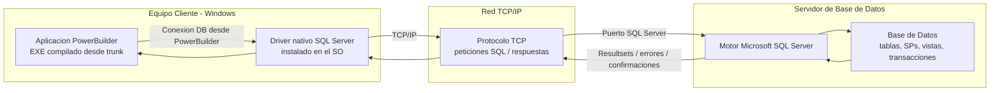

# Session: 2026-06-04 11:49:45 UTC

- **Session Key**: agent:main:discord:direct:1502021711057649704
- **Session ID**: 56bda16c-113e-49a5-b15a-3158544d48f2
- **Source**: discord

## Conversation Summary

assistant: Este diagrama representa la arquitectura cliente/servidor PowerBuilder con `EXE` generado desde `trunk`, ejecutado en Windows, accediendo a SQL Server mediante driver nativo y TCP/IP:



Lectura funcional del flujo:

1. El usuario ejecuta el `EXE` PowerBuilder en una estación Windows.
2. La aplicación usa el driver nativo de SQL Server disponible en el sistema operativo cliente.
3. Las consultas, transacciones y llamadas a objetos SQL viajan por TCP/IP hacia el servidor.
4. SQL Server procesa la petición contra la base de datos.
5. El resultado vuelve por TCP/IP al driver del cliente y luego a la aplicación PowerBuilder.

Punto importante para el diagrama: en esta arquitectura no hay una capa intermedia de aplicación. El cliente PowerBuilder se conecta directamente al motor SQL Server.
user: usando el repositorio trunk, donde se usa afi_histo_ingresos? Para que es?
assistant: Encontré `afi_histo_ingresos` en el trunk `lcamaratta-infomedical-trunk`.

**Para qué es**

`afi_histo_ingresos` guarda el historial de fechas de ingreso de un afiliado/integrante. La propia tabla lo documenta como:

`Registrar Historico de Fechas de ingreso del afiliado (solicitado por FIAT)`

Estructura clave:

- `prepaga`
- `contra`
- `inte`
- `ingre_fecha`
- `alta_fecha`
- `modi_fecha`
- `baja_fecha`

La PK es `(prepaga, contra, inte, ingre_fecha)`, o sea: un mismo afiliado/integrante puede tener varias fechas históricas de ingreso.

**Dónde se usa**

En base de datos:

- `backend/tables/afi_histo_ingresos.sql:1`
  Define la tabla.
- `backend/procedures/afs_afi_histo_ingresos.sql:12`
  Consulta el histórico para una `prepaga` y `contra`.
- `backend/procedures/afu_afi_histo_ingresos.sql:15`
  Inserta o actualiza registros del histórico.
- `backend/procedures/afi_import_batch.sql`
  Lo mantiene durante importaciones batch de afiliados.
- `backend/procedures/afi_import_batch_isss.sql`
  Uso equivalente en importación ISSS.
- `backend/procedures/afu_reincorpora_afiliados.sql`
  Lo actualiza cuando se reincorpora un afiliado.
- `backend/procedures/afu_soli_abordar1.sql`
  Lo actualiza en procesos de abordaje/reafiliación.

En PowerBuilder / EXE:

- `exe/Source Infomedical/d_afi_histo_ingresos.srd:16`
  DataWindow que ejecuta `dbo.afs_afi_histo_ingresos`.
- `exe/Source Infomedical/wr_ficha_afiliado.srw:2097`
  Asocia el DataWindow a la pestaña de ficha del afiliado.
- `exe/Source Infomedical/wr_ficha_afiliado.srw:3398`
  Hace el `Retrieve(li_prepaga, ls_contra)`.
- `exe/Source Infomedical/wr_ficha_afiliado.srw:862`
  Controla si la pestaña “Hist. Fecha de Ingreso” tiene datos.
- `exe/Source Infomedical/valida2.pbg`
  Incluye `d_afi_histo_ingresos.srd` dentro del build PowerBuilder.

**Conclusión funcional**

Es una tabla histórica auxiliar de `afiliados`. Sirve para ver y mantener las distintas vigencias de fecha de ingreso de cada integrante dentro de una ficha de afiliado. No reemplaza a `afiliados.ingre_fecha`; conserva el historial cuando hay cambios, bajas, reincorporaciones o importaciones que modifican esa fecha.
user: Existe un tipo de documento por defecto en el sistema?
assistant: Síntesis: en el trunk no encontré un tipo de documento por defecto vigente y central para todo el sistema.

**Evidencia**

En PowerBuilder existía un default global:

```powerscript
STRING gs_docu_tipo='DN'
```

pero está comentado y acompañado por esta nota:

```powerscript
PL 20030730 Este DEFAULT no va más porque no sirve para Brasil
```

Está en `exe/Source Infomedical/uo_nv_global_vars.sru:166`.

En base de datos tampoco aparece un `DEFAULT` para `docu_tipo` en las tablas principales revisadas:

- `backend/tables/afiliados.sql:28`: `docu_tipo char(2) NULL`
- `backend/tables/soli_afiliados.sql:24`: `docu_tipo char(2) NOT NULL`
- `backend/tables/PRECARGA_SOLI_AFILIADOS.sql:19`: `docu_tipo CHAR(2) NOT NULL`

La tabla catálogo es `docu_tipos`, definida en `backend/tables/docu_tipos.sql`. Ahí se administran los tipos válidos, pero no se define uno como default del sistema.

**Conclusión**

No hay un tipo de documento por defecto global vigente. El sistema usa el catálogo `docu_tipos` y en las pantallas PowerBuilder normalmente se selecciona desde un dropdown. Para solicitudes y precargas el campo es obligatorio, pero debe venir informado o elegido; no lo completa automáticamente con un default general.

También aparecen valores hardcodeados en usos puntuales, por ejemplo `DN`, `DU` o `XX`, pero son reglas específicas de procesos, ejemplos, integraciones o mapeos, no un default general del sistema.
user: Se pueden tener dos contratos con el mismo numero y tipo de documento?
assistant: Sí, físicamente se pueden registrar dos filas con el mismo `docu_tipo` y `docu_nro`, porque en `afiliados` la clave primaria es:

`prepaga, contra, inte`

No hay una constraint única por documento. Ver [afiliados.sql](/home/luispicone/.openclaw/workspace/svn/lcamaratta-infomedical-trunk/backend/tables/afiliados.sql:49).

Pero funcionalmente el sistema intenta impedir que una persona esté activa en otro contrato con el mismo tipo y número de documento.

Regla detectada:

- En precarga/solicitudes se genera rechazo `1084` si existe un afiliado con el mismo `docu_tipo` y `docu_nro` cuya `baja_fecha` sea `NULL` o posterior a la fecha de aplicación. Ver [ars_precarga_solicitud_validar.sql](/home/luispicone/.openclaw/workspace/svn/lcamaratta-infomedical-trunk/backend/procedures/ars_precarga_solicitud_validar.sql:972).
- En abordaje de solicitud, si el documento ya está en otro contrato activo, corta con el mensaje: `El Nro. de Documento ya se encuentra registrado en otro contrato.` Ver [afu_soli_abordar1.sql](/home/luispicone/.openclaw/workspace/svn/lcamaratta-infomedical-trunk/backend/procedures/afu_soli_abordar1.sql:293).
- También valida contra solicitudes pendientes no finalizadas/rechazadas para el mismo documento. Ver [ars_precarga_solicitud_validar.sql](/home/luispicone/.openclaw/workspace/svn/lcamaratta-infomedical-trunk/backend/procedures/ars_precarga_solicitud_validar.sql:1037).

Conclusión: **dos contratos con el mismo tipo y número de documento no deberían coexistir activos**. Sí puede haber registros históricos o dados de baja, porque la restricción funcional se apoya en vigencia (`baja_fecha`) y no en una unique constraint física.
user: Necesito ver como se puede hacer sobre el servicio TransactionServ ejecutarTransaccion que esta dentro de la carpeta ws_autorizaciones_remotas que reciba un query string con el xml como en la imagen. Hoy en dia recibe un SOAP con un parametro que tiene todo el xml. El cliente quiere llamar el servicio como REST pasandole el xml en un query string
assistant: Implementé la opción mínima sin romper SOAP.

Quedó así:

- SOAP sigue igual en `/TransactionServ`.
- Nuevo acceso HTTP tipo REST/simple servlet:
  - `/Do?pass=&msj=<xml_url_encoded>`
  - `/TransactionServRest?msj=<xml_url_encoded>`

El XML debe venir URL-encoded, porque si viene crudo en query string se rompen caracteres como `&`, `+`, espacios, `#`, etc.

Archivos impactados:

- [TransactionServ.java](/home/luispicone/.openclaw/workspace/svn/lcamaratta-autorizaciones_remotas-trunk/src/java/com/autorem/service/TransactionServ.java:28)
  - `EjecutarTransaccion` ahora delega en `ejecutarTransaccionXml`.
  - La lógica SOAP queda intacta.
- [TransactionServRestServlet.java](/home/luispicone/.openclaw/workspace/svn/lcamaratta-autorizaciones_remotas-trunk/src/java/com/autorem/service/TransactionServRestServlet.java:17)
  - Nuevo servlet que lee `msj` desde query string y ejecuta la misma lógica.
- [web.xml](/home/luispicone/.openclaw/workspace/svn/lcamaratta-autorizaciones_remotas-trunk/web/WEB-INF/web.xml:47)
  - Registra el servlet nuevo.
  - Mapea `/Do` y `/TransactionServRest`.

Ejemplo conceptual:

```text
/jitelservlet/Do?pass=&msj=%3CMensaje%3E...%3C%2FMensaje%3E
```

Validaciones ejecutadas:

- `web.xml` parsea correctamente como XML.
- Se preservaron finales de línea: `.java` en CRLF, `web.xml` en LF.
- `svn status` muestra:
  - `M TransactionServ.java`
  - `M web.xml`
  - `? TransactionServRestServlet.java`

No pude compilar localmente porque este entorno no tiene `ant` ni `javac` instalados. Tampoco ejecuté `svn add`, porque no fue pedido explícitamente.
user: Dejar los cambios en el compartido de Leandroi
assistant: Listo. Dejé los cambios en el compartido de Leandro, carpeta:

`autorizaciones_remotas_rest_querystring_20260603_1922`

Archivos incluidos:

- `TransactionServ.java`
- `TransactionServRestServlet.java`
- `web.xml`

Validé comparación byte a byte contra el working copy: los tres archivos coinciden exactamente. No hice `svn add`, commit ni cambios en el remoto.
user: por que este es diferente?
assistant: Es diferente porque son dos mecanismos distintos:

`TransactionServ` original es SOAP/JAX-WS. Por eso en `web.xml` no apunta a tu clase de negocio, sino a:

```xml
com.sun.xml.ws.transport.http.servlet.WSServlet
```

Ese `WSServlet` es el servlet de infraestructura de Metro/JAX-WS. Recibe el SOAP, interpreta el envelope, busca el endpoint real en la configuración JAX-WS y recién ahí invoca `TransactionServ.EjecutarTransaccion`.

El nuevo:

```xml
com.autorem.service.TransactionServRestServlet
```

es un servlet HTTP común creado para recibir directamente:

```text
?msj=<xml_url_encoded>
```

No usa SOAP, no usa envelope, no pasa por `WSServlet`. Lee el parámetro del query string y llama a la misma lógica interna que usa SOAP.

Entonces la diferencia es correcta:

- SOAP: `TransactionServ` se publica a través de `WSServlet`.
- REST/query string: se publica con un servlet propio `TransactionServRestServlet`.

La clase de negocio sigue siendo `TransactionServ`; el servlet nuevo solo es una entrada alternativa HTTP para llegar a la misma ejecución.
user: Explicar esto. Cuando se ejecuta el doGet y el doPost?
assistant: `doGet` y `doPost` son los puntos de entrada HTTP del servlet.

`doGet` se ejecuta cuando el cliente llama al servicio con método **GET**, normalmente desde una URL directa o query string:

```text
/Do?pass=&msj=%3CMensaje%3E...%3C%2FMensaje%3E
```

En ese caso, el XML viene en el parámetro `msj` de la URL.

`doPost` se ejecuta cuando el cliente llama al servicio con método **POST**, normalmente desde Postman, curl, una integración o formulario HTTP. El parámetro `msj` puede venir en el body como `application/x-www-form-urlencoded`, o también en la URL si el cliente lo manda así.

En este código ambos hacen lo mismo:

```java
ejecutarTransaccion(request, response);
```

Eso significa que se acepta la misma operación por GET y por POST. La lógica real está centralizada en `ejecutarTransaccion`, que:

1. Lee el parámetro `msj`:
   ```java
   String mensajeXml = request.getParameter("msj");
   ```

2. Define que la respuesta será XML UTF-8:
   ```java
   response.setCharacterEncoding("UTF-8");
   response.setContentType("text/xml; charset=UTF-8");
   ```

3. Si no vino `msj`, devuelve HTTP 400:
   ```xml
   <ERROR><DETALLE>Parametro msj requerido</DETALLE></ERROR>
   ```

4. Si vino `msj`, llama a la lógica existente:
   ```java
   new TransactionServ().ejecutarTransaccionXml(mensajeXml);
   ```

Conclusión: `doGet` cubre la llamada tipo REST por query string, que es lo que pidió el cliente. `doPost` queda habilitado como alternativa para enviar lo mismo por POST, útil si el XML es largo o si no quieren exponerlo completo en la URL.
