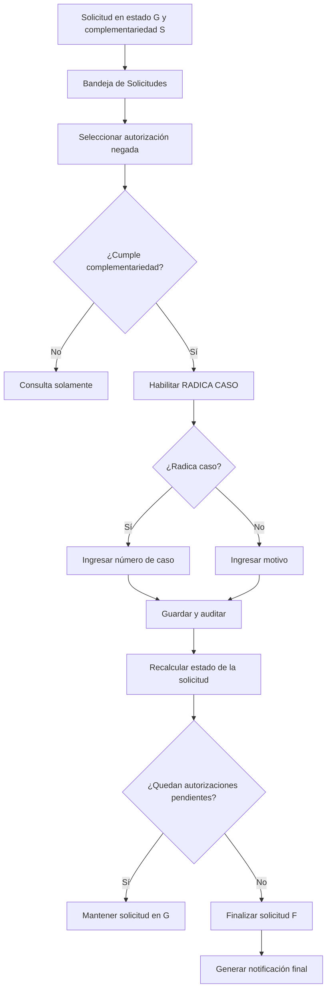

# Memoria de conversación — Wilmer Higuera

## Datos

- **Fecha:** 01/10/2026
- **Usuario:** Wilmer Higuera
- **ID Google Chat:** `users/113120678211994207734`
- **Canal:** Google Chat
- **Zona horaria:** America/Argentina/Buenos_Aires
- **Cantidad de intervenciones:** 22
- **Inicio:** 14:19:23
- **Fin:** 18:04:15

## Sesiones revisadas

- `agent:main:googlechat:direct:spaces/qzugpyaaaae`

## Archivos revisados

- `openclaw-agent.sqlite` (`4da5af4c-9cc9-48fb-8a7c-ec3c892d00a6`)

---

## Transcripción completa

### [01/10/2026 14:19:23] Wilmer Higuera

Hola Lisa, porfa, ayúdame a validar por que la solicitud 25920276 que se finalizo en InstallQA, no realizo la debida notificación

---

### [01/10/2026 14:19:34] Agente

Wilmer, validaré en `InstallQA` la solicitud `25920276` en modo de solo lectura: estado y autorizaciones, registros de notificación/correo, adjuntos PDF y trazabilidad temporal. Luego contrastaré el resultado con las condiciones que exige el flujo de notificación para identificar la causa exacta.

---

### [01/10/2026 14:20:19] Agente

La solicitud sí está finalizada (`F`) y tiene dos autorizaciones aceptadas, pero ambas tienen `archivo_path_full = NULL`. Además, solo aparece una notificación creada al registrar la solicitud, no una notificación de finalización. Voy a determinar si el flujo se detuvo por falta de PDF, por condición funcional o porque no se invocó el coordinador final.

---

### [01/10/2026 14:23:46] Agente

La configuración `USA API Adjuntos` está habilitada y el procedimiento de adjuntos recupera correctamente las dos autorizaciones. Sin embargo, ambas quedaron como `adjunto_disponible = 'N'`; por eso el coordinador de correo nunca recibió XML de adjuntos ni creó el mail final. Estoy verificando si el fallo es específico de las autorizaciones tipo cirugía (`C`) o si la llamada automática no llegó a ejecutarse.

---

### [01/10/2026 14:27:23] Agente

Wilmer, validé la solicitud `25920276` en `InstallQA` mediante consultas de solo lectura.

## Resultado principal

La solicitud quedó correctamente finalizada:

| Dato | Resultado |
|---|---|
| Solicitud | `25920276` |
| Tipo | `Q` — Cirugía |
| Estado | `F` — Finalizada |
| Fecha de finalización | `27/09/2026 17:37:43` |
| Autorizaciones | `22596578` y `22596579` |
| Estado de ambas | `A` — Autorizadas |
| Complementariedad | `N` |

Al estar las dos autorizaciones aceptadas, correspondía generar la notificación al afiliado mediante:

```text
proceso_id = 8
```

## Notificaciones encontradas

Solo existe esta notificación:

```text
mail_id : 9989429
asunto  : Registro Solicitud No.25920276
proceso : 7
```

Ese correo corresponde al **registro inicial**, no a la finalización. Fue enviado correctamente por InfoMaker.

No existe:

```text
Finalización Solicitud No.25920276
proceso_id: 8
```

Tampoco existe auditoría que indique que se haya ejecutado la notificación final.

## Causa localizada

Las dos autorizaciones quedaron sin PDF:

| Autorización | Estado | `archivo_path_full` |
|---:|:---:|---|
| `22596578` | `A` | `NULL` |
| `22596579` | `A` | `NULL` |

El procedimiento de preparación devuelve:

```text
22596578.pdf → adjunto_disponible = N
22596579.pdf → adjunto_disponible = N
```

El flujo automático de [`wp_soli_reg.ue_aceptar`](/home/desarrollo-ia-05/.openclaw/workspace/svn/whiguera-Version84-Modelo2Gis/exe_presmed/Source%20Infomedical/wp_soli_reg.srw:3600) hace lo siguiente:

```text
Solicitud queda F
    ↓
of_preparar_adjuntos_finalizada
    ↓
Generar PDF
    ↓
Subir PDF a API
    ↓
Actualizar AUTORIZACIONES.archivo_path_full
    ↓
pru_solicitudes_auto_notif_finalizada
```

Si la preparación del adjunto falla, el código retorna antes de ejecutar:

```sql
pru_solicitudes_auto_notif_finalizada
```

Eso coincide exactamente con los datos:

```text
Solicitud finalizada             Sí
PDF registrado                   No
archivo_path_full                NULL
Auditoría proceso 8              No
MAIL_ENVIO de finalización       No
```

## Validaciones adicionales

No encontré impedimentos en la base:

- `USA API Adjuntos = 'S'`.
- El procedimiento de adjuntos recupera ambas autorizaciones.
- Ambas están en estado notificable `A`.
- `prs_auto_impresion_especial_opc` devuelve opción `0`.
- `prs_auto_impre` recupera una fila para cada autorización.
- El afiliado tiene correos informados.

Por lo tanto, el problema no está en el estado, destinatario, plantilla ni clasificación del proceso.

## Diagnóstico

La notificación no se generó porque el flujo se detuvo **antes del SP de notificación**, durante la preparación de los PDF de las autorizaciones.

La base no registra el error concreto de PowerBuilder, pero, descartadas las validaciones SQL, el fallo quedó limitado a uno de estos pasos ejecutados en cliente:

```text
1. Exportación del DataWindow a PDF.
2. Creación del archivo temporal.
3. Subida del PDF a la API.
4. Actualización de archivo_path_full.
```

El primer PDF tampoco llegó a registrar su ruta, por lo que el error ocurrió durante el procesamiento de `22596578` o antes de completar su actualización.

### Conclusión

```text
La solicitud sí quedó finalizada.
La notificación final nunca se creó.
La causa inmediata fue la preparación fallida/no completada de los PDF.
El coordinador pru_solicitudes_auto_notif_finalizada no llegó a ejecutarse.
```

No realicé modificaciones en la base de datos ni en el repositorio.

---

### [01/10/2026 15:25:42] Wilmer Higuera

Lisa, continuando con la misma solicitud, recupere la solicitud en registro se solicitudes y di clic en el botón Enviar Notificación, mira el error me sale, te comparto la imnagen

---

### [01/10/2026 15:26:01] Agente

Wilmer, la imagen aporta el dato que faltaba: el proceso sí llegó a SQL Server, pero fue rechazado por opciones de sesión incompatibles (`ANSI_NULLS`/`QUOTED_IDENTIFIER` y relacionadas). Voy a verificar qué alcanzó a persistirse en `25920276` y localizar la sentencia `INSERT` exacta que exige esas opciones, para separar el error principal del mensaje secundario de PowerBuilder.

---

### [01/10/2026 15:26:55] Agente

El reintento manual sí generó y subió correctamente los dos PDF: ahora ambas autorizaciones tienen `archivo_path_full`. El fallo ocurre después, al insertar el correo o sus adjuntos. La metadata confirma que varios procedimientos de mail fueron creados con `ANSI_NULLS` y/o `QUOTED_IDENTIFIER` desactivados, exactamente lo indicado por SQL Server. Localizaré cuál es el primer objeto incompatible y cómo debe recrearse.

---

### [01/10/2026 15:27:53] Agente

Wilmer, la imagen confirma que el reintento llega hasta la etapa de notificación y falla por opciones `SET` incompatibles (`ANSI_NULLS` y `QUOTED_IDENTIFIER`). Voy a completar la trazabilidad para identificar el primer procedimiento/`INSERT` que falla y darte la corrección mínima, sin modificar `InstallQA` ni el repositorio.

---

### [01/10/2026 15:29:55] Agente

La imagen confirma dos hechos: los PDF se prepararon correctamente y el fallo ocurre al insertar la notificación en SQL Server. El segundo mensaje (“Procedure has not been executed…”) es consecuencia del primero; no es otra causa. Estoy verificando ahora qué objeto dependiente exige esas opciones para no corregir procedimientos de más.

---

### [01/10/2026 15:31:46] Agente

Wilmer, la imagen confirma la causa exacta.

## Causa raíz

El error principal es:

```text
INSERT failed because the following SET options have incorrect settings:
'ANSI_NULLS, QUOTED_IDENTIFIER'
```

La notificación final ejecuta:

```text
pru_solicitudes_auto_notif_finalizada
→ pri_solicitudes_auto_notif
```

El procedimiento `pri_solicitudes_auto_notif` recibe el XML con los PDF y ejecuta este bloque:

```sql
INSERT INTO #ADJUNTOS_NOTIF
(
    file_name,
    archivo_path_full
)
SELECT
    T.c.value('(file_name)[1]', 'VARCHAR(500)'),
    T.c.value('(archivo_path_full)[1]', 'VARCHAR(500)')
FROM @prm_adjuntos.nodes(
    '/d_soli_auto_adjuntos_mail_xml/d_soli_auto_adjuntos_mail_xml_row'
) AS T(c)
```

Está en [pri_solicitudes_auto_notif.sql:131](/home/desarrollo-ia-05/.openclaw/workspace/svn/whiguera-Version84-Modelo2Gis/backend/procedures/pri_solicitudes_auto_notif.sql:131).

Ese `INSERT` utiliza métodos XML `nodes()` y `value()`, que exigen las opciones correctas.

En `InstallQA`, el procedimiento fue creado con:

```text
uses_ansi_nulls        = 0
uses_quoted_identifier = 0
```

Aunque dentro del procedimiento aparecen:

```sql
SET ANSI_NULLS ON
SET QUOTED_IDENTIFIER ON
```

eso no corrige el problema. Estas dos opciones quedan almacenadas cuando se ejecuta `CREATE PROCEDURE` o `ALTER PROCEDURE`.

## Qué alcanzó a realizar el botón

El reintento dejó correctamente los dos PDF:

```text
22596578 → archivo_path_full informado
22596579 → archivo_path_full informado
```

Pero continúa sin existir:

```text
Notificación de finalización
proceso_id = 8
```

Solo permanece el correo inicial:

```text
mail_id    = 9989429
asunto     = Registro Solicitud No.25920276
status     = ENV
```

Por lo tanto:

```text
Generación del PDF       OK
Subida a la API          OK
Registro archivo_path    OK
Lectura del XML          ERROR
Creación MAIL_ENVIO      NO ejecutada
Notificación final       NO generada
```

## Corrección mínima

En [pri_solicitudes_auto_notif.sql](/home/desarrollo-ia-05/.openclaw/workspace/svn/whiguera-Version84-Modelo2Gis/backend/procedures/pri_solicitudes_auto_notif.sql) deben agregarse las opciones **antes del `CREATE PROCEDURE`**, cada una en su propio lote:

```sql
IF OBJECT_ID('dbo.pri_solicitudes_auto_notif') IS NOT NULL
    DROP PROCEDURE dbo.pri_solicitudes_auto_notif
GO

SET ANSI_NULLS ON
GO

SET QUOTED_IDENTIFIER ON
GO

CREATE PROCEDURE dbo.pri_solicitudes_auto_notif
(
    -- parámetros actuales
)
AS
BEGIN
    -- contenido actual
END
GO
```

No alcanza con tenerlas dentro del cuerpo en las líneas 24 y 28.

## Después de corregirlo

Hay que volver a ejecutar el botón **Enviar Notificación** para `25920276`.

Los PDF ya tienen `archivo_path_full`, por lo que deberían reutilizarse. El resultado esperado es:

```text
MAIL_ENVIO creado
SOLICITUDES_AUTO_NOTIFICACIONES creada
MAIL_ATTACH_BINARY con 2 PDF
Auditoría con proceso_id: 8
```

El mensaje:

```text
Procedure has not been executed or has no results
```

es secundario: PowerBuilder intenta continuar con el procedimiento después del error SQL principal.

No modifiqué el procedimiento, la base de datos ni el repositorio.

---

### [01/10/2026 15:41:27] Wilmer Higuera

¿Pero por que con la finalización de las otras solicitudes no dio ese error?

---

### [01/10/2026 15:42:03] Agente

Wilmer, **si las otras solicitudes ejecutaron el mismo bloque XML, con la misma versión del SP y las mismas opciones efectivas, también deberían haber fallado**. No es una diferencia causada por ser una solicitud de cirugía ni por tener dos PDF.

Para explicar por qué antes funcionó, debemos distinguir estas posibilidades:

| Posibilidad | Qué explicaría |
|---|---|
| El SP fue recreado o alterado después de las pruebas exitosas | Pudo quedar guardado con `ANSI_NULLS` y `QUOTED_IDENTIFIER` desactivados |
| Las otras notificaciones siguieron otro camino | Pudieron no ejecutar el bloque que procesa los adjuntos mediante `nodes()` y `value()` |
| Cambió el contexto de ejecución | Algunas opciones efectivas pueden diferir entre conexiones o formas de invocar SQL |

**La primera posibilidad es una hipótesis, no un hecho confirmado.** La metadata actual indica cómo está creado el procedimiento ahora; no demuestra cómo estaba cuando se notificaron las solicitudes anteriores.

### Qué debemos comparar

Tomando una solicitud que sí generó la **notificación de finalización**:

1. Fecha de creación de ese correo —no solamente el correo de registro—.
2. Si tenía PDF adjuntos.
3. Procedimiento y bloque utilizados para generarlo.
4. Fecha de modificación y versión desplegada de `pri_solicitudes_auto_notif`.

Si ese correo se generó antes de una modificación del SP, sería compatible con que el problema se introdujera al desplegarlo nuevamente, aunque la fecha por sí sola no lo prueba.

**También corrijo mi diagnóstico inicial:** que `archivo_path_full` estuviera vacío no demostraba que hubiera fallado la generación del PDF. El reintento confirmó que los PDF se generan; el error visible está en la etapa SQL de notificación. No podemos asegurar retrospectivamente que la finalización automática fallara por el mismo motivo sin su mensaje o registro de ejecución.

En resumen: **el error actual está confirmado, pero todavía falta comprobar qué cambió respecto de las ejecuciones exitosas.**

---

### [01/10/2026 17:01:41] Wilmer Higuera

Quedo bien, Lisa estamos con la Tarea #26486, es la tarea padre, de las tareas hijas ya terminamos la Tarea #29496 y la Tarea #29500, ahora vamos a continuar con la Tarea #29497, el GAP 005 – Ajuste Bandeja de Solicitudes - Gestión de Autorizaciones Negadas, en la ubicación A:\whiguera\Tarea #26486, esta el documento funcional llamado R26486-EF_V3.doc, analízalo completamente y me indicas que se pide hacer y como lo haremos, paso a paso bien detallado

---

### [01/10/2026 17:01:52] Agente

Wilmer, voy a recuperar primero el contexto operativo obligatorio de esta sesión y luego analizaré completo `R26486-EF_V3.doc`, enfocándome en la **Tarea #29497 / GAP 005** y sus dependencias con los GAP ya terminados. Te entregaré requerimiento funcional, impacto técnico y un paso a paso detallado, sin modificar repositorio ni base de datos.

---

### [01/10/2026 17:02:18] Agente

La recuperación quedó completa. Tomo como contexto vigente para esta conversación:

- **Tarea padre:** `#26486`
- **Tarea actual:** `#29497`
- **GAP:** `005 – Ajuste Bandeja de Solicitudes - Gestión de Autorizaciones Negadas`
- **Repositorio de análisis:** `whiguera-Version84-Modelo2Gis`
- **Modalidad:** consultiva, sin cambios ni commits.

Ahora validaré el documento y cruzaré el GAP 005 con los objetos actuales del repositorio y con lo ya implementado para GAP 004 y GAP 008.

---

### [01/10/2026 17:03:43] Agente

Ya identifiqué el alcance funcional completo del GAP 005. Ahora revisaré cómo está construida actualmente la Bandeja de Solicitudes —ventana, DataWindows, consultas, detalle de autorizaciones, carta de negación y SP existente para guardar el número de caso— para que el plan se apoye en objetos reales y no en supuestos.

---

### [01/10/2026 17:07:41] Agente

Wilmer, analicé completamente las 42 páginas del documento [R26486-EF_V3.doc](</mnt/Agentes/whiguera/Tarea #26486/R26486-EF_V3.doc>) y lo contrasté con la revisión `37916` de la rama actual.

# Tarea #29497 — GAP 005

## Objetivo funcional

El GAP 005 permite gestionar desde la **Bandeja de Solicitudes** las autorizaciones negadas que requieren un trámite de complementariedad ante la EPS.

El flujo parte de solicitudes que los GAP 004/008 devuelven al estado:

```text
G — En gestión
```

Esas solicitudes deben permanecer en `G` hasta que el ejecutivo registre qué ocurrió con cada autorización negada:

- Se radicó un caso ante la EPS y se informa su número.
- No se radicó y se informa el motivo.

Una vez resueltas todas las autorizaciones de la solicitud, esta puede pasar a:

```text
F — Finalizada
```

y ejecutar posteriormente la notificación final.

---

# 1. Flujo funcional completo



---

# 2. Cuándo una autorización participa

La autorización debe cumplir simultáneamente:

```text
AUTORIZACIONES.auto_esta = 'N'
```

Debe tener carta de negación finalizada:

```text
CARTA_NEGACION.final_fecha IS NOT NULL
```

La EPS debe manejar complementariedad:

```text
OBRAS_SOCIALES.complementariedad IN ('O', 'L')
```

El programa debe tener habilitada la complementariedad:

```text
PLANES.complementariedad = 'S'
```

El tipo de solicitud debe participar:

```text
SOLICITUDES_AUTO_TIPOS.complementariedad = 'S'
```

Y la solicitud debe estar marcada:

```text
SOLICITUDES_AUTO.complementariedad = 'S'
```

Esta regla ya está parcialmente centralizada en:

[pru_valida_marca_complementariedad.sql](/home/desarrollo-ia-05/.openclaw/workspace/svn/whiguera-Version84-Modelo2Gis/backend/procedures/pru_valida_marca_complementariedad.sql)

Este procedimiento cambia la solicitud de `F` a `G` y limpia responsables para que vuelva a asignarse.

---

# 3. Cambios en la Bandeja de Solicitudes

Ventana afectada:

[wp_bandeja_solicitudes.srw](/home/desarrollo-ia-05/.openclaw/workspace/svn/whiguera-Version84-Modelo2Gis/exe_presmed/Source%20Infomedical/wp_bandeja_solicitudes.srw)

## Nuevo filtro

Agregar un checkbox:

```text
GESTIÓN DE NEGACIONES COMPLEMENTARIEDAD
```

Comportamiento:

| Checkbox | Filtro |
|---|---|
| Marcado | `SOLICITUDES_AUTO.complementariedad = 'S'` |
| Desmarcado | `SOLICITUDES_AUTO.complementariedad = 'N'` |

Según el documento, debe iniciar desmarcado.

El filtro debe agregarse a:

- [d_filtro_bandeja_solicitudes.srd](/home/desarrollo-ia-05/.openclaw/workspace/svn/whiguera-Version84-Modelo2Gis/exe_presmed/Source%20Infomedical/d_filtro_bandeja_solicitudes.srd)
- `wp_bandeja_solicitudes.wf_retrieve()`
- [prs_solicitudes_auto_bandeja.sql](/home/desarrollo-ia-05/.openclaw/workspace/svn/whiguera-Version84-Modelo2Gis/backend/procedures/prs_solicitudes_auto_bandeja.sql)

Debe añadirse un nuevo argumento al final del `Retrieve()` para no alterar el orden de los 24 argumentos existentes.

## Alerta visual

La grilla debe mostrar una alerta cuando exista al menos una autorización que cumpla las condiciones de complementariedad.

Texto sugerido por el documento:

```text
Se requiere el registro de caso radicado en EPS por autorización NEGADA
```

En SQL conviene calcularla mediante `EXISTS`, no agregando directamente todas las tablas con `INNER JOIN`, porque una solicitud puede tener varias autorizaciones y se podrían duplicar filas.

Conceptualmente:

```sql
CASE
    WHEN EXISTS
    (
        SELECT 1
        FROM SOLICITUDES_AUTO_AUTORIZACIONES SAA
        INNER JOIN AUTORIZACIONES A
            ON A.sucur = SAA.sucur
            AND A.auto = SAA.auto
        -- demás relaciones
        WHERE SAA.soli_auto = SA.soli_auto
        AND A.auto_esta = 'N'
        AND -- carta finalizada
        AND -- EPS O/L
        AND -- plan complementario
        AND -- tipo de solicitud complementario
    )
    THEN 'S'
    ELSE 'N'
END
```

La columna debe exponerse en:

[d_lista_bandeja_solicitudes.srd](/home/desarrollo-ia-05/.openclaw/workspace/svn/whiguera-Version84-Modelo2Gis/exe_presmed/Source%20Infomedical/d_lista_bandeja_solicitudes.srd)

---

# 4. Cambios en el detalle de autorizaciones

Actualmente la pestaña utiliza:

[d_bandeja_auto.srd](/home/desarrollo-ia-05/.openclaw/workspace/svn/whiguera-Version84-Modelo2Gis/exe_presmed/Source%20Infomedical/d_bandeja_auto.srd)

y recupera datos mediante:

[prs_solicitudes_auto_autorizaciones_bandeja.sql](/home/desarrollo-ia-05/.openclaw/workspace/svn/whiguera-Version84-Modelo2Gis/backend/procedures/prs_solicitudes_auto_autorizaciones_bandeja.sql)

El DataWindow todavía no devuelve los datos necesarios para complementariedad.

## Campos nuevos

### RADICA CASO

Checkbox:

```text
S = Sí se radicó
N = No se radicó
```

Reglas:

- Inicialmente protegido.
- Se habilita solamente cuando la autorización cumple todas las condiciones.
- Si se marca:
  - habilita el número de caso;
  - limpia y protege el motivo.
- Si se desmarca:
  - limpia y protege el número;
  - habilita el motivo.

### NRO CASO RADICADO EN EPS

Características:

```text
Tipo:        Alfanumérico
Longitud:    10
Persistencia AUTORIZACIONES.complementariedad_nro_caso
```

Solo se habilita cuando:

```text
RADICA CASO = 'S'
```

### MOTIVO

Características indicadas por el documento:

```text
Tipo:       Alfanumérico
Longitud:   100
```

Se habilita cuando:

```text
RADICA CASO = 'N'
```

## Botones

Se necesitan al menos:

- **Guardar/Aceptar gestión**
- **Consultar carta de negación**

Para consultar la carta puede reutilizarse la lógica existente en:

[wr_detalle_solicitud_autorizacion.srw](/home/desarrollo-ia-05/.openclaw/workspace/svn/whiguera-Version84-Modelo2Gis/exe_presmed/Source%20Infomedical/wr_detalle_solicitud_autorizacion.srw)

```powerscript
lstr_auto.sucur = dw_lista.object.sucur[row]
lstr_auto.auto  = dw_lista.object.auto[row]
lstr_auto.consu = 'S'

OPENWITHPARM(wp_carta_negacion, lstr_auto)
```

---

# 5. Ajustes necesarios en la base

Actualmente existe:

```text
AUTORIZACIONES.complementariedad_nro_caso CHAR(10)
```

Pero no encontré en el modelo actual los otros dos campos requeridos funcionalmente.

Se propone agregar:

```sql
complementariedad_radica_caso CHAR(1) NULL
complementariedad_motivo VARCHAR(100) NULL
```

El contrato quedaría:

| Campo | Tipo | Uso |
|---|---|---|
| `complementariedad_radica_caso` | `CHAR(1)` | Decisión `S/N` |
| `complementariedad_nro_caso` | `CHAR(10)` | Número radicado |
| `complementariedad_motivo` | `VARCHAR(100)` | Motivo de no radicación |

No recomiendo interpretar `nro_caso IS NULL` como “no radica”, porque no permite distinguir entre:

- Registro todavía pendiente.
- Decisión explícita de no radicar.

---

# 6. Validación del número de caso

El documento establece:

- El mismo número puede existir en EPS diferentes.
- No puede utilizarse dentro de la misma EPS para otro afiliado.
- Tampoco puede utilizarse para otra autorización del mismo afiliado y EPS.

En términos funcionales:

```text
El número de caso es único dentro de una EPS
y debe pertenecer a una única autorización/afiliado.
```

Validación conceptual:

```sql
IF EXISTS
(
    SELECT 1
    FROM AUTORIZACIONES A
    INNER JOIN -- relación con EPS
    WHERE EPS = @eps_actual
    AND A.complementariedad_nro_caso = @prm_nro_caso
    AND NOT
    (
        A.sucur = @prm_sucur
        AND A.auto = @prm_auto
    )
)
BEGIN
    -- devolver error
END
```

La validación principal debe estar en SQL Server. PowerBuilder puede anticiparla, pero no garantiza integridad ante dos usuarios simultáneos.

---

# 7. Refactor del procedimiento de guardado

Existe:

[pru_guardar_nro_caso.sql](/home/desarrollo-ia-05/.openclaw/workspace/svn/whiguera-Version84-Modelo2Gis/backend/procedures/pru_guardar_nro_caso.sql)

Pero actualmente:

- Solo actualiza el número.
- Recibe `VARCHAR(50)` aunque la columna es `CHAR(10)`.
- No guarda `RADICA CASO`.
- No guarda el motivo.
- No valida elegibilidad.
- No controla duplicados.
- No audita.
- No recalcula la solicitud.
- No genera notificación.
- Utiliza `RTRIM`, que debemos retirar según tus convenciones.

## Contrato propuesto

```sql
@prm_sucur          SMALLINT,
@prm_auto           NUMERIC,
@prm_radica_caso    CHAR(1),
@prm_nro_caso       CHAR(10),
@prm_motivo         VARCHAR(100),
@prm_usuario        VARCHAR(...)
```

El procedimiento debe:

1. Identificar la solicitud relacionada.
2. Bloquear o leer consistentemente el registro actual.
3. Volver a validar las condiciones de complementariedad.
4. Validar `RADICA CASO IN ('S','N')`.
5. Si es `S`:
   - exigir número;
   - prohibir motivo.
6. Si es `N`:
   - prohibir número;
   - exigir motivo cuando corresponda.
7. Validar la unicidad dentro de la EPS.
8. Guardar los tres campos atómicamente.
9. Registrar auditoría.
10. Recalcular el estado de la solicitud.
11. Informar a PowerBuilder si la solicitud:
    - permanece en `G`;
    - cambió a `F`.

---

# 8. Auditoría

El documento solicita auditar:

```text
Activación de caso radicado en EPS nro: <número>
```

```text
Modificación de caso radicado en EPS nro: <número>
```

```text
RETIRO de caso radicado en EPS nro: <número>
```

El procedimiento debe leer los valores anteriores antes del `UPDATE`.

Ejemplos:

| Antes | Después | Auditoría |
|---|---|---|
| Sin registro | `S` + número | Activación |
| Número `123` | Número `456` | Modificación |
| `S` + número | `N` + motivo | Retiro |
| `N` + motivo A | `N` + motivo B | Modificación de decisión/motivo |

Puede reutilizarse:

```text
pri_auto_auditoria
```

La auditoría debe estar dentro de la misma transacción que la actualización de la autorización.

---

# 9. Regla para finalizar la solicitud

La solicitud debe permanecer en `G` mientras exista una autorización sin resolución.

Debe cambiar a `F` solamente cuando todas sus autorizaciones estén en una condición terminal:

```text
Autorizada
Anulada
Negada con carta finalizada
y gestión de complementariedad registrada
```

Para una autorización negada complementaria, no basta con que exista la carta. Debe existir una decisión:

```text
radica_caso = 'S' y nro_caso informado
```

o:

```text
radica_caso = 'N' y motivo informado
```

La consulta debería utilizar `NOT EXISTS`:

```sql
IF NOT EXISTS
(
    SELECT 1
    FROM autorizaciones relacionadas
    WHERE autorización todavía no está resuelta
)
BEGIN
    UPDATE SOLICITUDES_AUTO
    SET soli_esta = 'F'
    WHERE soli_auto = @soli_auto
END
```

Esto soporta correctamente solicitudes con varias autorizaciones.

---

# 10. Notificación final

Si la solicitud permanece en `G`:

```text
No se genera notificación final
```

Si cambia a `F`:

```text
Se ejecuta el flujo de notificación final
```

Debe reutilizarse el proceso que ya venimos trabajando:

```text
uo_nv_soli_auto_notificacion
→ preparación/reutilización de PDF
→ pru_solicitudes_auto_notif_finalizada
→ MAIL_ENVIO
→ envío posterior por InfoMaker
```

Debe garantizarse:

- Una sola notificación final.
- No notificar si continúa en `G`.
- Incluir la carta de negación/PDF correspondiente.
- Evitar PDF huérfanos si falla la transacción.
- Reutilizar `archivo_path_full` cuando ya exista.

---

# 11. Ambigüedades encontradas en el documento

Antes de escribir código conviene cerrar estos puntos.

## EPS `O` y `L`

La interpretación más coherente es:

| Código | Comportamiento |
|---|---|
| `O` | Complementariedad obligatoria |
| `L` | Complementariedad permitida/opcional |

Sin embargo, el documento tiene frases contradictorias respecto de finalizar “sin número de caso”.

Recomiendo normalizar así:

- EPS `O`:
  - registrar número; o
  - registrar explícitamente que no se radicó y su motivo, si esa excepción está permitida.
- EPS `L`:
  - puede registrarse número;
  - si se decide no radicar, debe guardarse la decisión y el motivo.
- Nunca finalizar solo porque el número está vacío.

## Registros históricos

El documento indica, en diferentes puntos, que los registros anteriores:

- deben permitir consultar la carta;
- y eventualmente podrían permitir registrar el caso si hoy cumplen las condiciones.

Debe definirse si una solicitud histórica ya `F` puede editarse o si solo se permite consulta.

Mi recomendación:

- Históricas finalizadas: consultar carta, sin modificar.
- Solicitudes regresadas a `G` por GAP 004/008: permitir gestión completa.

## Filtros adicionales

El documento menciona:

- EPS
- Grupo de programas
- Programa
- Número de caso
- Tipo de plan
- Estado

Pero el detalle más completo aparece en la sección posterior vinculada al GAP 006, correspondiente al registro de notificaciones.

Para GAP 005 considero confirmado únicamente el nuevo filtro de complementariedad. Los demás filtros deben validarse para evitar implementarlos en la pantalla equivocada.

---

# 12. Orden recomendado de implementación

## Paso 1 — Cerrar las reglas funcionales

Confirmar:

1. Regla exacta para EPS `O`.
2. Regla exacta para EPS `L`.
3. Tratamiento de solicitudes históricas.
4. Condición exacta de `G → F`.
5. Si los filtros amplios pertenecen al GAP 005 o GAP 006.

## Paso 2 — Ampliar el modelo

Agregar en `AUTORIZACIONES`:

```text
complementariedad_radica_caso
complementariedad_motivo
```

Conservar el número como `CHAR(10)`.

## Paso 3 — Centralizar la elegibilidad

Crear o ampliar una consulta que devuelva por autorización:

```text
EPS
Modalidad O/L
Programa complementario
Tipo de solicitud complementario
Carta finalizada
Autorización negada
Editable S/N
Alerta S/N
Radica caso
Número
Motivo
```

No duplicar estas reglas en distintos eventos PowerBuilder.

## Paso 4 — Modificar la bandeja

Actualizar:

- Filtro.
- Argumentos de `Retrieve`.
- Procedimiento principal.
- Grilla y alerta visual.

## Paso 5 — Modificar detalle de autorizaciones

Actualizar:

- Procedimiento de detalle.
- Columnas del DataWindow.
- Protección dinámica.
- Botones Guardar y Carta de negación.
- Validaciones inmediatas de interfaz.

## Paso 6 — Implementar guardado transaccional

Actualizar `pru_guardar_nro_caso` o reemplazarlo por un procedimiento de gestión integral.

Debe guardar, validar, auditar y recalcular dentro de una sola transacción lógica.

## Paso 7 — Integrar transición de estado

Determinar si quedan autorizaciones pendientes:

```text
Sí → mantener G
No → cambiar a F
```

## Paso 8 — Integrar notificación

Solo si el procedimiento informa que la solicitud acaba de quedar `F`.

## Paso 9 — Regenerar objetos PowerBuilder

Regenerar:

```text
d_filtro_bandeja_solicitudes
d_lista_bandeja_solicitudes
d_bandeja_auto
wp_bandeja_solicitudes
```

Y verificar firmas de procedimientos y argumentos de recuperación.

---

# 13. Matriz mínima de pruebas

| Caso | Resultado esperado |
|---|---|
| Solicitud no complementaria | No aparece con filtro marcado |
| Solicitud complementaria `G` | Aparece en la bandeja |
| Autorización no negada | Campos protegidos |
| Negada sin carta final | Campos protegidos |
| EPS no complementaria | Campos protegidos |
| Programa no complementario | Campos protegidos |
| Tipo no complementario | Campos protegidos |
| Radica `S` con número válido | Guarda |
| Radica `S` sin número | Rechaza |
| Radica `S` con motivo | Rechaza o limpia el motivo |
| Radica `N` con motivo | Guarda |
| Radica `N` sin motivo obligatorio | Rechaza |
| Mismo número en otra EPS | Permite |
| Mismo número en misma EPS/otra autorización | Rechaza |
| Número con más de 10 caracteres | Rechaza |
| Quedan autorizaciones pendientes | Mantiene `G` |
| Todas resueltas | Cambia a `F` |
| Cambio a `F` | Genera una notificación |
| Reintento | No duplica notificación |
| Consulta carta | Abre `wp_carta_negacion` |
| Cambio de número | Audita modificación |
| Retiro de número | Audita retiro |
| Registro histórico finalizado | Aplica la regla que definamos |
| Error al subir PDF | Compensa archivo remoto y no deja inconsistencia |

---

# Conclusión

La Tarea #29497 no consiste únicamente en agregar el campo de número de caso. Requiere integrar cinco componentes:

```text
1. Filtro y alerta en la bandeja
2. Gestión RADICA / NÚMERO / MOTIVO
3. Validación de unicidad por EPS
4. Auditoría y recálculo G → F
5. Notificación final cuando toda la solicitud esté resuelta
```

El repositorio ya contiene una parte de la infraestructura, pero `pru_guardar_nro_caso` y `d_bandeja_auto` todavía no cubren el contrato funcional completo.

No modifiqué archivos, procedimientos ni datos. El siguiente paso debe ser acordar las ambigüedades funcionales señaladas y después comenzar por el modelo de datos y el procedimiento transaccional. La etapa queda analizada, pero no cerrada hasta tu validación.

---

### [01/10/2026 18:01:39] Wilmer Higuera

Lisa, guarda lo trabajado el día de hoy con todos los detalles para continuar mañana, me indicas como te escribo mañana para que recuperes donde quedamos, hasta mañana, muchas gracias por tu colaboración

---

### [01/10/2026 18:01:49] Agente

Wilmer, voy a consolidar la jornada de hoy en tu memoria curada: avances, diagnósticos, decisiones, objetos involucrados y el punto exacto desde el que continuaremos con la Tarea #29497. Después te dejaré una frase corta para retomar mañana sin perder contexto.

---

### [01/10/2026 18:02:30] Agente

Ya identifiqué el alcance de la jornada y el punto de continuidad. Voy a dejar especialmente asentados: las pruebas y diagnósticos de notificación, la limpieza compensatoria de PDF, las consultas auxiliares realizadas y el análisis integral de la Tarea #29497, incluyendo ambigüedades, objetos afectados y orden de implementación.

---

### [01/10/2026 18:04:15] Agente

Listo, Wilmer. Guardé la memoria completa de hoy.

- **Modo:** bajo demanda
- **Fecha:** 2026-10-01
- **Usuario activo:** Wilmer Higuera
- **Archivo creado:** [Memoria del 01/10/2026](/home/desarrollo-ia-05/.openclaw/workspace/memory/MEMORY-users_113120678211994207734-2026-10-01.md)
- **Archivos actualizados:** 0
- **Archivos excluidos:** 0
- **Errores pendientes:** ninguno

Mañana escribime:

> Lisa, recupera mi memoria del 01/10/2026 y continuemos con la Tarea #29497, GAP 005, desde el cierre del contrato funcional.

Con eso retomaremos exactamente desde las ambigüedades funcionales pendientes, antes de diseñar el modelo de datos y el procedimiento transaccional.

Hasta mañana, Wilmer. Muchas gracias.

---

## Origen

Memoria generada automáticamente a partir del historial local de sesiones de OpenClaw.
